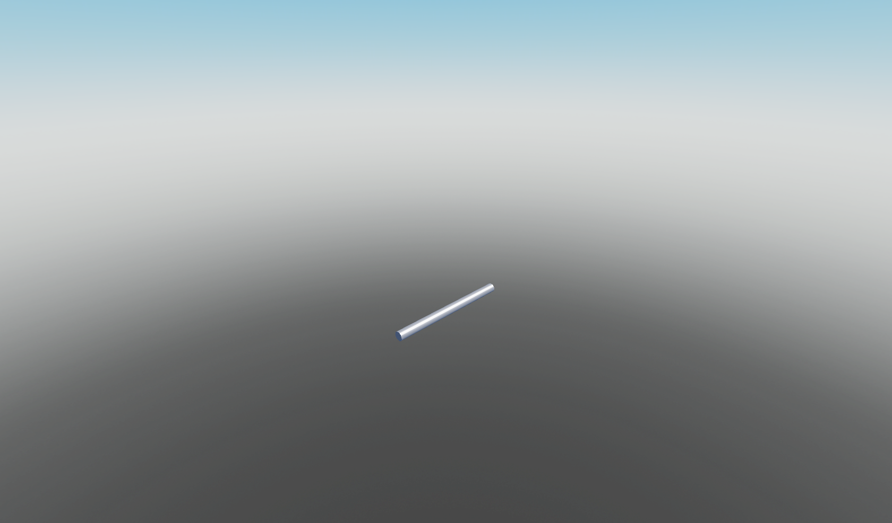

# Blocks

## Building Blocks

  
Block

  
Cone

  
Corner Quadrant

  
Corner Wedge

  
Corner Wedge 2

  
Cube

  
Cylinder

  
Cylinder Panel

  
Cylinder V2

  
Hexagon

  
Hexagon Panel

  
Hollow Cone

  
Hollow Cylinder

  
Hollow Sphere

  
Image

  
Inverted Cylinder

  
Inverted Cylinder Panel

  
Inverted Quarter Cylinder

  
Octagon

  
Octagon Panel

  
Panel

  
Pyramid

  
Quadrant

  
Seat Block

  
Slab

  
Sphere

  
Truss

  
Wedge

  
Wedge 2

## Christmas

  
Menorah

  
Present

  
Wreath

## Decorations

  
Holographic Text

  
Label

  
Light Block

  
Sign

  
Surface Light Block

## Functional Block

  
Sound Block

  
Spawnlocation

## Logics

  
And Gate

  
Bool Storage

  
Bool Switch Gate

  
Button

  
Constant If

  
Decrement Gate

  
Delay Gate

  
Door Block

  
Increment Gate

  
Inverter Gate

  
Number Storage

  
Or Gate

  
Setter Boolean

  
Setter Number

  
Setter String

  
String Storage

  
Switch

  
Xor Gate

## Nature

  
Pole

  
Pole End

  
Post

  
Snow

  
Thin Post

## SciFi

  
Captains Chair

  
Catwalk

  
Chair Short

  
Chair Tall

  
Exterior Column

  
Interior Hall Panel

  
Space Bed

  
Space Window

  
Space Window Corner

## Terrain

  
Asphalt

  
Basalt

  
Brick

  
Cobblestone

  
Concrete

  
Cracked Lava

  
Glacier

  
Grass

  
Ground

  
Ice

  
Leafy Grass

  
Limestone

  
Mud

  
Pavement

  
Rock

  
Salt

  
Sand

  
Sandstone

  
Slate

  
Snow

  
Water

  
Wood Planks

## Urban

  
No Cycling Sign

  
No Parking Sign

  
Speed Limit Sign

