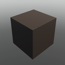

# Blocks

## Building Blocks

  

    <a href="#/Blocks/Block.md">
      
      
Block

    </a>
    <!-- VSCode nav: [Blocks/Block.md](Blocks/Block.md) -->
  

  

    <a href="#/Blocks/Cone.md">
      
      
Cone

    </a>
    <!-- VSCode nav: [Blocks/Cone.md](Blocks/Cone.md) -->
  

  

    <a href="#/Blocks/Corner_Quadrant.md">
      
      
Corner Quadrant

    </a>
    <!-- VSCode nav: [Blocks/Corner_Quadrant.md](Blocks/Corner_Quadrant.md) -->
  

  

    <a href="#/Blocks/Corner_Wedge.md">
      
      
Corner Wedge

    </a>
    <!-- VSCode nav: [Blocks/Corner_Wedge.md](Blocks/Corner_Wedge.md) -->
  

  

    <a href="#/Blocks/Corner_Wedge_2.md">
      
      
Corner Wedge 2

    </a>
    <!-- VSCode nav: [Blocks/Corner_Wedge_2.md](Blocks/Corner_Wedge_2.md) -->
  

  

    <a href="#/Blocks/Cube.md">
      
      
Cube

    </a>
    <!-- VSCode nav: [Blocks/Cube.md](Blocks/Cube.md) -->
  

  

    <a href="#/Blocks/Cylinder.md">
      
      
Cylinder

    </a>
    <!-- VSCode nav: [Blocks/Cylinder.md](Blocks/Cylinder.md) -->
  

  

    <a href="#/Blocks/Cylinder_Panel.md">
      
      
Cylinder Panel

    </a>
    <!-- VSCode nav: [Blocks/Cylinder_Panel.md](Blocks/Cylinder_Panel.md) -->
  

  

    <a href="#/Blocks/Cylinder_V2.md">
      
      
Cylinder V2

    </a>
    <!-- VSCode nav: [Blocks/Cylinder_V2.md](Blocks/Cylinder_V2.md) -->
  

  

    <a href="#/Blocks/Hexagon.md">
      
      
Hexagon

    </a>
    <!-- VSCode nav: [Blocks/Hexagon.md](Blocks/Hexagon.md) -->
  

  

    <a href="#/Blocks/Hexagon_Panel.md">
      
      
Hexagon Panel

    </a>
    <!-- VSCode nav: [Blocks/Hexagon_Panel.md](Blocks/Hexagon_Panel.md) -->
  

  

    <a href="#/Blocks/Hollow_Cone.md">
      
      
Hollow Cone

    </a>
    <!-- VSCode nav: [Blocks/Hollow_Cone.md](Blocks/Hollow_Cone.md) -->
  

  

    <a href="#/Blocks/Hollow_Cylinder.md">
      
      
Hollow Cylinder

    </a>
    <!-- VSCode nav: [Blocks/Hollow_Cylinder.md](Blocks/Hollow_Cylinder.md) -->
  

  

    <a href="#/Blocks/Hollow_Sphere.md">
      
      
Hollow Sphere

    </a>
    <!-- VSCode nav: [Blocks/Hollow_Sphere.md](Blocks/Hollow_Sphere.md) -->
  

  

    <a href="#/Blocks/Image.md">
      
      
Image

    </a>
    <!-- VSCode nav: [Blocks/Image.md](Blocks/Image.md) -->
  

  

    <a href="#/Blocks/Inverted_Cylinder.md">
      
      
Inverted Cylinder

    </a>
    <!-- VSCode nav: [Blocks/Inverted_Cylinder.md](Blocks/Inverted_Cylinder.md) -->
  

  

    <a href="#/Blocks/Inverted_Cylinder_Panel.md">
      
      
Inverted Cylinder Panel

    </a>
    <!-- VSCode nav: [Blocks/Inverted_Cylinder_Panel.md](Blocks/Inverted_Cylinder_Panel.md) -->
  

  

    <a href="#/Blocks/Inverted_Quarter_Cylinder.md">
      
      
Inverted Quarter Cylinder

    </a>
    <!-- VSCode nav: [Blocks/Inverted_Quarter_Cylinder.md](Blocks/Inverted_Quarter_Cylinder.md) -->
  

  

    <a href="#/Blocks/Octagon.md">
      
      
Octagon

    </a>
    <!-- VSCode nav: [Blocks/Octagon.md](Blocks/Octagon.md) -->
  

  

    <a href="#/Blocks/Octagon_Panel.md">
      
      
Octagon Panel

    </a>
    <!-- VSCode nav: [Blocks/Octagon_Panel.md](Blocks/Octagon_Panel.md) -->
  

  

    <a href="#/Blocks/Panel.md">
      
      
Panel

    </a>
    <!-- VSCode nav: [Blocks/Panel.md](Blocks/Panel.md) -->
  

  

    <a href="#/Blocks/Pyramid.md">
      
      
Pyramid

    </a>
    <!-- VSCode nav: [Blocks/Pyramid.md](Blocks/Pyramid.md) -->
  

  

    <a href="#/Blocks/Quadrant.md">
      
      
Quadrant

    </a>
    <!-- VSCode nav: [Blocks/Quadrant.md](Blocks/Quadrant.md) -->
  

  

    <a href="#/Blocks/Seat_Block.md">
      
      
Seat Block

    </a>
    <!-- VSCode nav: [Blocks/Seat_Block.md](Blocks/Seat_Block.md) -->
  

  

    <a href="#/Blocks/Slab.md">
      
      
Slab

    </a>
    <!-- VSCode nav: [Blocks/Slab.md](Blocks/Slab.md) -->
  

  

    <a href="#/Blocks/Sphere.md">
      
      
Sphere

    </a>
    <!-- VSCode nav: [Blocks/Sphere.md](Blocks/Sphere.md) -->
  

  

    <a href="#/Blocks/Truss.md">
      
      
Truss

    </a>
    <!-- VSCode nav: [Blocks/Truss.md](Blocks/Truss.md) -->
  

  

    <a href="#/Blocks/Wedge.md">
      
      
Wedge

    </a>
    <!-- VSCode nav: [Blocks/Wedge.md](Blocks/Wedge.md) -->
  

  

    <a href="#/Blocks/Wedge_2.md">
      
      
Wedge 2

    </a>
    <!-- VSCode nav: [Blocks/Wedge_2.md](Blocks/Wedge_2.md) -->
  

## Christmas

  

    <a href="#/Blocks/Menorah.md">
      
      
Menorah

    </a>
    <!-- VSCode nav: [Blocks/Menorah.md](Blocks/Menorah.md) -->
  

  

    <a href="#/Blocks/Present.md">
      
      
Present

    </a>
    <!-- VSCode nav: [Blocks/Present.md](Blocks/Present.md) -->
  

  

    <a href="#/Blocks/Wreath.md">
      
      
Wreath

    </a>
    <!-- VSCode nav: [Blocks/Wreath.md](Blocks/Wreath.md) -->
  

## Decorations

  

    <a href="#/Blocks/Holographic_Text.md">
      
      
Holographic Text

    </a>
    <!-- VSCode nav: [Blocks/Holographic_Text.md](Blocks/Holographic_Text.md) -->
  

  

    <a href="#/Blocks/Label.md">
      
      
Label

    </a>
    <!-- VSCode nav: [Blocks/Label.md](Blocks/Label.md) -->
  

  

    <a href="#/Blocks/Light_Block.md">
      
      
Light Block

    </a>
    <!-- VSCode nav: [Blocks/Light_Block.md](Blocks/Light_Block.md) -->
  

  

    <a href="#/Blocks/Sign.md">
      
      
Sign

    </a>
    <!-- VSCode nav: [Blocks/Sign.md](Blocks/Sign.md) -->
  

  

    <a href="#/Blocks/Surface_Light_Block.md">
      
      
Surface Light Block

    </a>
    <!-- VSCode nav: [Blocks/Surface_Light_Block.md](Blocks/Surface_Light_Block.md) -->
  

## Functional Block

  

    <a href="#/Blocks/Sound_Block.md">
      
      
Sound Block

    </a>
    <!-- VSCode nav: [Blocks/Sound_Block.md](Blocks/Sound_Block.md) -->
  

  

    <a href="#/Blocks/Spawnlocation.md">
      
      
Spawnlocation

    </a>
    <!-- VSCode nav: [Blocks/Spawnlocation.md](Blocks/Spawnlocation.md) -->
  

## Nature

  

    <a href="#/Blocks/Pole.md">
      
      
Pole

    </a>
    <!-- VSCode nav: [Blocks/Pole.md](Blocks/Pole.md) -->
  

  

    <a href="#/Blocks/Pole_End.md">
      
      
Pole End

    </a>
    <!-- VSCode nav: [Blocks/Pole_End.md](Blocks/Pole_End.md) -->
  

  

    <a href="#/Blocks/Post.md">
      
      
Post

    </a>
    <!-- VSCode nav: [Blocks/Post.md](Blocks/Post.md) -->
  

  

    <a href="#/Blocks/Snow.md">
      
      
Snow

    </a>
    <!-- VSCode nav: [Blocks/Snow.md](Blocks/Snow.md) -->
  

  

    <a href="#/Blocks/Thin_Post.md">
      
      
Thin Post

    </a>
    <!-- VSCode nav: [Blocks/Thin_Post.md](Blocks/Thin_Post.md) -->
  

## SciFi

  

    <a href="#/Blocks/Captains_Chair.md">
      
      
Captains Chair

    </a>
    <!-- VSCode nav: [Blocks/Captains_Chair.md](Blocks/Captains_Chair.md) -->
  

  

    <a href="#/Blocks/Catwalk.md">
      
      
Catwalk

    </a>
    <!-- VSCode nav: [Blocks/Catwalk.md](Blocks/Catwalk.md) -->
  

  

    <a href="#/Blocks/Chair_Short.md">
      
      
Chair Short

    </a>
    <!-- VSCode nav: [Blocks/Chair_Short.md](Blocks/Chair_Short.md) -->
  

  

    <a href="#/Blocks/Chair_Tall.md">
      
      
Chair Tall

    </a>
    <!-- VSCode nav: [Blocks/Chair_Tall.md](Blocks/Chair_Tall.md) -->
  

  

    <a href="#/Blocks/Exterior_Column.md">
      
      
Exterior Column

    </a>
    <!-- VSCode nav: [Blocks/Exterior_Column.md](Blocks/Exterior_Column.md) -->
  

  

    <a href="#/Blocks/Interior_Hall_Panel.md">
      
      
Interior Hall Panel

    </a>
    <!-- VSCode nav: [Blocks/Interior_Hall_Panel.md](Blocks/Interior_Hall_Panel.md) -->
  

  

    <a href="#/Blocks/Space_Bed.md">
      
      
Space Bed

    </a>
    <!-- VSCode nav: [Blocks/Space_Bed.md](Blocks/Space_Bed.md) -->
  

  

    <a href="#/Blocks/Space_Window.md">
      
      
Space Window

    </a>
    <!-- VSCode nav: [Blocks/Space_Window.md](Blocks/Space_Window.md) -->
  

  

    <a href="#/Blocks/Space_Window_Corner.md">
      
      
Space Window Corner

    </a>
    <!-- VSCode nav: [Blocks/Space_Window_Corner.md](Blocks/Space_Window_Corner.md) -->
  

## Terrain

  

    <a href="#/Blocks/Asphalt.md">
      
      
Asphalt

    </a>
    <!-- VSCode nav: [Blocks/Asphalt.md](Blocks/Asphalt.md) -->
  

  

    <a href="#/Blocks/Basalt.md">
      
      
Basalt

    </a>
    <!-- VSCode nav: [Blocks/Basalt.md](Blocks/Basalt.md) -->
  

  

    <a href="#/Blocks/Brick.md">
      
      
Brick

    </a>
    <!-- VSCode nav: [Blocks/Brick.md](Blocks/Brick.md) -->
  

  

    <a href="#/Blocks/Cobblestone.md">
      
      
Cobblestone

    </a>
    <!-- VSCode nav: [Blocks/Cobblestone.md](Blocks/Cobblestone.md) -->
  

  

    <a href="#/Blocks/Concrete.md">
      
      
Concrete

    </a>
    <!-- VSCode nav: [Blocks/Concrete.md](Blocks/Concrete.md) -->
  

  

    <a href="#/Blocks/Cracked_Lava.md">
      
      
Cracked Lava

    </a>
    <!-- VSCode nav: [Blocks/Cracked_Lava.md](Blocks/Cracked_Lava.md) -->
  

  

    <a href="#/Blocks/Glacier.md">
      
      
Glacier

    </a>
    <!-- VSCode nav: [Blocks/Glacier.md](Blocks/Glacier.md) -->
  

  

    <a href="#/Blocks/Grass.md">
      
      
Grass

    </a>
    <!-- VSCode nav: [Blocks/Grass.md](Blocks/Grass.md) -->
  

  

    <a href="#/Blocks/Ground.md">
      
      
Ground

    </a>
    <!-- VSCode nav: [Blocks/Ground.md](Blocks/Ground.md) -->
  

  

    <a href="#/Blocks/Ice.md">
      
      
Ice

    </a>
    <!-- VSCode nav: [Blocks/Ice.md](Blocks/Ice.md) -->
  

  

    <a href="#/Blocks/Leafy_Grass.md">
      
      
Leafy Grass

    </a>
    <!-- VSCode nav: [Blocks/Leafy_Grass.md](Blocks/Leafy_Grass.md) -->
  

  

    <a href="#/Blocks/Limestone.md">
      
      
Limestone

    </a>
    <!-- VSCode nav: [Blocks/Limestone.md](Blocks/Limestone.md) -->
  

  

    <a href="#/Blocks/Mud.md">
      
      
Mud

    </a>
    <!-- VSCode nav: [Blocks/Mud.md](Blocks/Mud.md) -->
  

  

    <a href="#/Blocks/Pavement.md">
      
      
Pavement

    </a>
    <!-- VSCode nav: [Blocks/Pavement.md](Blocks/Pavement.md) -->
  

  

    <a href="#/Blocks/Rock.md">
      
      
Rock

    </a>
    <!-- VSCode nav: [Blocks/Rock.md](Blocks/Rock.md) -->
  

  

    <a href="#/Blocks/Salt.md">
      
      
Salt

    </a>
    <!-- VSCode nav: [Blocks/Salt.md](Blocks/Salt.md) -->
  

  

    <a href="#/Blocks/Sand.md">
      
      
Sand

    </a>
    <!-- VSCode nav: [Blocks/Sand.md](Blocks/Sand.md) -->
  

  

    <a href="#/Blocks/Sandstone.md">
      
      
Sandstone

    </a>
    <!-- VSCode nav: [Blocks/Sandstone.md](Blocks/Sandstone.md) -->
  

  

    <a href="#/Blocks/Slate.md">
      
      
Slate

    </a>
    <!-- VSCode nav: [Blocks/Slate.md](Blocks/Slate.md) -->
  

  

    <a href="#/Blocks/Snow.md">
      
      
Snow

    </a>
    <!-- VSCode nav: [Blocks/Snow.md](Blocks/Snow.md) -->
  

  

    <a href="#/Blocks/Water.md">
      
      
Water

    </a>
    <!-- VSCode nav: [Blocks/Water.md](Blocks/Water.md) -->
  

  

    <a href="#/Blocks/Wood_Planks.md">
      
      
Wood Planks

    </a>
    <!-- VSCode nav: [Blocks/Wood_Planks.md](Blocks/Wood_Planks.md) -->
  

## Urban

  

    <a href="#/Blocks/No_Cycling_Sign.md">
      
      
No Cycling Sign

    </a>
    <!-- VSCode nav: [Blocks/No_Cycling_Sign.md](Blocks/No_Cycling_Sign.md) -->
  

  

    <a href="#/Blocks/No_Parking_Sign.md">
      
      
No Parking Sign

    </a>
    <!-- VSCode nav: [Blocks/No_Parking_Sign.md](Blocks/No_Parking_Sign.md) -->
  

  

    <a href="#/Blocks/Speed_Limit_Sign.md">
      
      
Speed Limit Sign

    </a>
    <!-- VSCode nav: [Blocks/Speed_Limit_Sign.md](Blocks/Speed_Limit_Sign.md) -->
  

