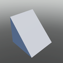
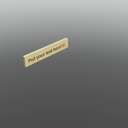
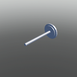
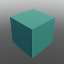

# Blocks

## Building Blocks

  

    <a href="#/Blocks/Block">
      
      
Block

    </a>
  

  

    <a href="#/Blocks/Cone">
      
      
Cone

    </a>
  

  

    <a href="#/Blocks/Corner_Quadrant">
      
      
Corner Quadrant

    </a>
  

  

    <a href="#/Blocks/Corner_Wedge">
      
      
Corner Wedge

    </a>
  

  

    <a href="#/Blocks/Corner_Wedge_2">
      
      
Corner Wedge 2

    </a>
  

  

    <a href="#/Blocks/Cube">
      
      
Cube

    </a>
  

  

    <a href="#/Blocks/Cylinder">
      
      
Cylinder

    </a>
  

  

    <a href="#/Blocks/Cylinder_Panel">
      
      
Cylinder Panel

    </a>
  

  

    <a href="#/Blocks/Cylinder_V2">
      
      
Cylinder V2

    </a>
  

  

    <a href="#/Blocks/Hexagon">
      
      
Hexagon

    </a>
  

  

    <a href="#/Blocks/Hexagon_Panel">
      
      
Hexagon Panel

    </a>
  

  

    <a href="#/Blocks/Hollow_Cone">
      
      
Hollow Cone

    </a>
  

  

    <a href="#/Blocks/Hollow_Cylinder">
      
      
Hollow Cylinder

    </a>
  

  

    <a href="#/Blocks/Hollow_Sphere">
      
      
Hollow Sphere

    </a>
  

  

    <a href="#/Blocks/Image">
      
      
Image

    </a>
  

  

    <a href="#/Blocks/Inverted_Cylinder">
      
      
Inverted Cylinder

    </a>
  

  

    <a href="#/Blocks/Inverted_Cylinder_Panel">
      
      
Inverted Cylinder Panel

    </a>
  

  

    <a href="#/Blocks/Inverted_Quarter_Cylinder">
      
      
Inverted Quarter Cylinder

    </a>
  

  

    <a href="#/Blocks/Octagon">
      
      
Octagon

    </a>
  

  

    <a href="#/Blocks/Octagon_Panel">
      
      
Octagon Panel

    </a>
  

  

    <a href="#/Blocks/Panel">
      
      
Panel

    </a>
  

  

    <a href="#/Blocks/Pyramid">
      
      
Pyramid

    </a>
  

  

    <a href="#/Blocks/Quadrant">
      
      
Quadrant

    </a>
  

  

    <a href="#/Blocks/Seat_Block">
      
      
Seat Block

    </a>
  

  

    <a href="#/Blocks/Slab">
      
      
Slab

    </a>
  

  

    <a href="#/Blocks/Sphere">
      
      
Sphere

    </a>
  

  

    <a href="#/Blocks/Truss">
      
      
Truss

    </a>
  

  

    <a href="#/Blocks/Wedge">
      
      
Wedge

    </a>
  

  

    <a href="#/Blocks/Wedge_2">
      
      
Wedge 2

    </a>
  

## Christmas

  

    <a href="#/Blocks/Menorah">
      
      
Menorah

    </a>
  

  

    <a href="#/Blocks/Present">
      
      
Present

    </a>
  

  

    <a href="#/Blocks/Wreath">
      
      
Wreath

    </a>
  

## Decorations

  

    <a href="#/Blocks/Holographic_Text">
      
      
Holographic Text

    </a>
  

  

    <a href="#/Blocks/Label">
      
      
Label

    </a>
  

  

    <a href="#/Blocks/Light_Block">
      
      
Light Block

    </a>
  

  

    <a href="#/Blocks/Sign">
      
      
Sign

    </a>
  

  

    <a href="#/Blocks/Surface_Light_Block">
      
      
Surface Light Block

    </a>
  

## Functional Block

  

    <a href="#/Blocks/Sound_Block">
      
      
Sound Block

    </a>
  

  

    <a href="#/Blocks/Spawnlocation">
      
      
Spawnlocation

    </a>
  

## Nature

  

    <a href="#/Blocks/Pole">
      
      
Pole

    </a>
  

  

    <a href="#/Blocks/Pole_End">
      
      
Pole End

    </a>
  

  

    <a href="#/Blocks/Post">
      
      
Post

    </a>
  

  

    <a href="#/Blocks/Snow">
      
      
Snow

    </a>
  

  

    <a href="#/Blocks/Thin_Post">
      
      
Thin Post

    </a>
  

## SciFi

  

    <a href="#/Blocks/Captains_Chair">
      
      
Captains Chair

    </a>
  

  

    <a href="#/Blocks/Catwalk">
      
      
Catwalk

    </a>
  

  

    <a href="#/Blocks/Chair_Short">
      
      
Chair Short

    </a>
  

  

    <a href="#/Blocks/Chair_Tall">
      
      
Chair Tall

    </a>
  

  

    <a href="#/Blocks/Exterior_Column">
      
      
Exterior Column

    </a>
  

  

    <a href="#/Blocks/Interior_Hall_Panel">
      
      
Interior Hall Panel

    </a>
  

  

    <a href="#/Blocks/Space_Bed">
      
      
Space Bed

    </a>
  

  

    <a href="#/Blocks/Space_Window">
      
      
Space Window

    </a>
  

  

    <a href="#/Blocks/Space_Window_Corner">
      
      
Space Window Corner

    </a>
  

## Terrain

  

    <a href="#/Blocks/Asphalt">
      
      
Asphalt

    </a>
  

  

    <a href="#/Blocks/Basalt">
      
      
Basalt

    </a>
  

  

    <a href="#/Blocks/Brick">
      
      
Brick

    </a>
  

  

    <a href="#/Blocks/Cobblestone">
      
      
Cobblestone

    </a>
  

  

    <a href="#/Blocks/Concrete">
      
      
Concrete

    </a>
  

  

    <a href="#/Blocks/Cracked_Lava">
      
      
Cracked Lava

    </a>
  

  

    <a href="#/Blocks/Glacier">
      
      
Glacier

    </a>
  

  

    <a href="#/Blocks/Grass">
      
      
Grass

    </a>
  

  

    <a href="#/Blocks/Ground">
      
      
Ground

    </a>
  

  

    <a href="#/Blocks/Ice">
      
      
Ice

    </a>
  

  

    <a href="#/Blocks/Leafy_Grass">
      
      
Leafy Grass

    </a>
  

  

    <a href="#/Blocks/Limestone">
      
      
Limestone

    </a>
  

  

    <a href="#/Blocks/Mud">
      
      
Mud

    </a>
  

  

    <a href="#/Blocks/Pavement">
      
      
Pavement

    </a>
  

  

    <a href="#/Blocks/Rock">
      
      
Rock

    </a>
  

  

    <a href="#/Blocks/Salt">
      
      
Salt

    </a>
  

  

    <a href="#/Blocks/Sand">
      
      
Sand

    </a>
  

  

    <a href="#/Blocks/Sandstone">
      
      
Sandstone

    </a>
  

  

    <a href="#/Blocks/Slate">
      
      
Slate

    </a>
  

  

    <a href="#/Blocks/Snow">
      
      
Snow

    </a>
  

  

    <a href="#/Blocks/Water">
      
      
Water

    </a>
  

  

    <a href="#/Blocks/Wood_Planks">
      
      
Wood Planks

    </a>
  

## Urban

  

    <a href="#/Blocks/No_Cycling_Sign">
      
      
No Cycling Sign

    </a>
  

  

    <a href="#/Blocks/No_Parking_Sign">
      
      
No Parking Sign

    </a>
  

  

    <a href="#/Blocks/Speed_Limit_Sign">
      
      
Speed Limit Sign

    </a>
  

