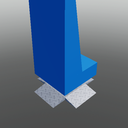

# Blocks

## Building Blocks

  

    
    
Block

  

  

    
    
Cone

  

  

    
    
Corner Quadrant

  

  

    
    
Corner Wedge

  

  

    
    
Corner Wedge 2

  

  

    
    
Cube

  

  

    
    
Cylinder

  

  

    
    
Cylinder Panel

  

  

    
    
Cylinder V2

  

  

    
    
Hexagon

  

  

    
    
Hexagon Panel

  

  

    
    
Hollow Cone

  

  

    
    
Hollow Cylinder

  

  

    
    
Hollow Sphere

  

  

    
    
Image

  

  

    
    
Inverted Cylinder

  

  

    
    
Inverted Cylinder Panel

  

  

    
    
Inverted Quarter Cylinder

  

  

    
    
Octagon

  

  

    
    
Octagon Panel

  

  

    
    
Panel

  

  

    
    
Pyramid

  

  

    
    
Quadrant

  

  

    
    
Seat Block

  

  

    
    
Slab

  

  

    
    
Sphere

  

  

    
    
Truss

  

  

    
    
Wedge

  

  

    
    
Wedge 2

  

## Christmas

  

    
    
Menorah

  

  

    
    
Present

  

  

    
    
Wreath

  

## Decorations

  

    
    
Holographic Text

  

  

    
    
Label

  

  

    
    
Light Block

  

  

    
    
Sign

  

  

    
    
Surface Light Block

  

## Functional Block

  

    
    
Sound Block

  

  

    
    
Spawnlocation

  

## Logics

  

    
    
And Gate

  

  

    
    
Bool Storage

  

  

    
    
Bool Switch Gate

  

  

    
    
Button

  

  

    
    
Constant If

  

  

    
    
Decrement Gate

  

  

    
    
Delay Gate

  

  

    
    
Door Block

  

  

    
    
Increment Gate

  

  

    
    
Inverter Gate

  

  

    
    
Number Storage

  

  

    
    
Or Gate

  

  

    
    
Setter Boolean

  

  

    
    
Setter Number

  

  

    
    
Setter String

  

  

    
    
String Storage

  

  

    
    
Switch

  

  

    
    
Xor Gate

  

## Nature

  

    
    
Pole

  

  

    
    
Pole End

  

  

    
    
Post

  

  

    
    
Snow

  

  

    
    
Thin Post

  

## SciFi

  

    
    
Captains Chair

  

  

    
    
Catwalk

  

  

    
    
Chair Short

  

  

    
    
Chair Tall

  

  

    
    
Exterior Column

  

  

    
    
Interior Hall Panel

  

  

    
    
Space Bed

  

  

    
    
Space Window

  

  

    
    
Space Window Corner

  

## Terrain

  

    
    
Asphalt

  

  

    
    
Basalt

  

  

    
    
Brick

  

  

    
    
Cobblestone

  

  

    
    
Concrete

  

  

    
    
Cracked Lava

  

  

    
    
Glacier

  

  

    
    
Grass

  

  

    
    
Ground

  

  

    
    
Ice

  

  

    
    
Leafy Grass

  

  

    
    
Limestone

  

  

    
    
Mud

  

  

    
    
Pavement

  

  

    
    
Rock

  

  

    
    
Salt

  

  

    
    
Sand

  

  

    
    
Sandstone

  

  

    
    
Slate

  

  

    
    
Snow

  

  

    
    
Water

  

  

    
    
Wood Planks

  

## Urban

  

    
    
No Cycling Sign

  

  

    
    
No Parking Sign

  

  

    
    
Speed Limit Sign

  

